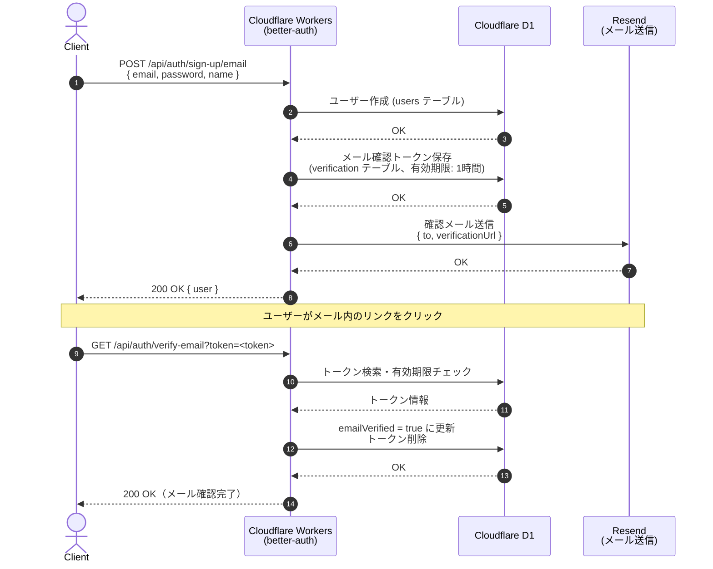
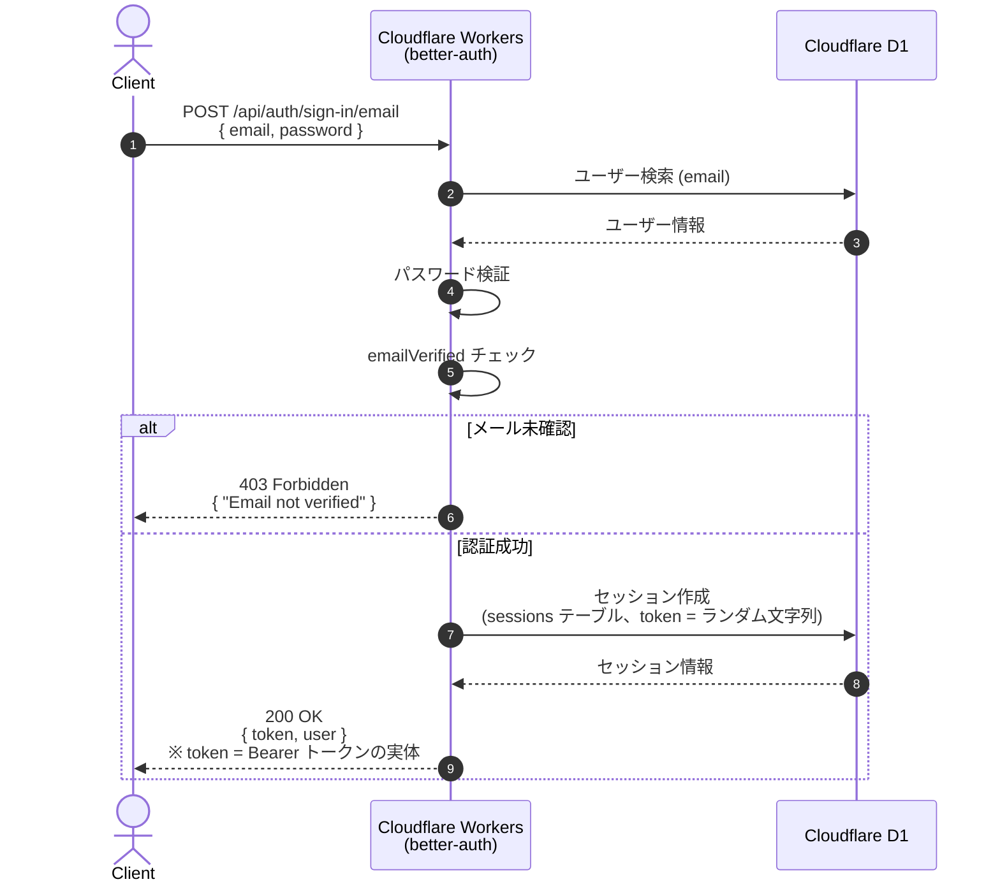
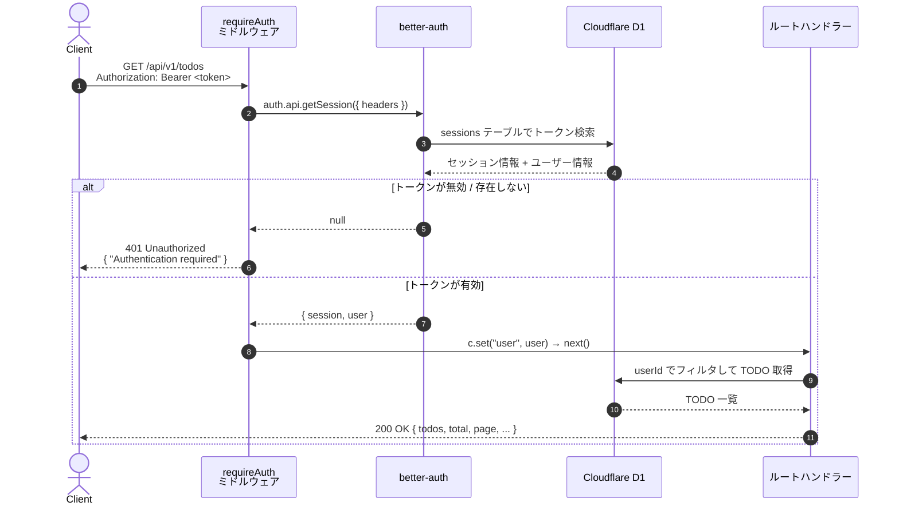
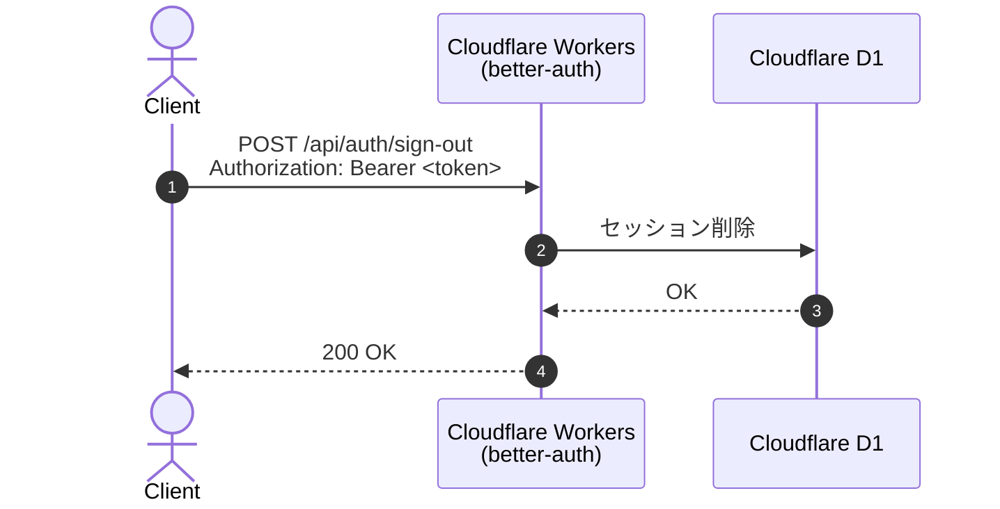

# 認証シーケンス図

## 1. ユーザー登録

```mermaid
sequenceDiagram
    autonumber
    actor Client
    participant API as Cloudflare Workers<br/>(better-auth)
    participant D1 as Cloudflare D1
    participant Mail as Resend<br/>(メール送信)

    Client->>API: POST /api/auth/sign-up/email<br/>{ email, password, name }
    API->>D1: ユーザー作成 (users テーブル)
    D1-->>API: OK
    API->>D1: メール確認トークン保存<br/>(verification テーブル、有効期限: 1時間)
    D1-->>API: OK
    API->>Mail: 確認メール送信<br/>{ to, verificationUrl }
    Mail-->>API: OK
    API-->>Client: 200 OK { user }

    Note over Client,Mail: ユーザーがメール内のリンクをクリック

    Client->>API: GET /api/auth/verify-email?token=<token>
    API->>D1: トークン検索・有効期限チェック
    D1-->>API: トークン情報
    API->>D1: emailVerified = true に更新<br/>トークン削除
    D1-->>API: OK
    API-->>Client: 200 OK（メール確認完了）
```

## 2. ログイン

```mermaid
sequenceDiagram
    autonumber
    actor Client
    participant API as Cloudflare Workers<br/>(better-auth)
    participant D1 as Cloudflare D1

    Client->>API: POST /api/auth/sign-in/email<br/>{ email, password }
    API->>D1: ユーザー検索 (email)
    D1-->>API: ユーザー情報
    API->>API: パスワード検証
    API->>API: emailVerified チェック

    alt メール未確認
        API-->>Client: 403 Forbidden<br/>{ "Email not verified" }
    else 認証成功
        API->>D1: セッション作成<br/>(sessions テーブル、token = ランダム文字列)
        D1-->>API: セッション情報
        API-->>Client: 200 OK<br/>{ token, user }<br/>※ token = Bearer トークンの実体
    end
```

## 3. Bearer トークン認証（TODO API へのリクエスト）

```mermaid
sequenceDiagram
    autonumber
    actor Client
    participant MW as requireAuth<br/>ミドルウェア
    participant Auth as better-auth
    participant D1 as Cloudflare D1
    participant Handler as ルートハンドラー

    Client->>MW: GET /api/v1/todos<br/>Authorization: Bearer <token>

    MW->>Auth: auth.api.getSession({ headers })
    Auth->>D1: sessions テーブルでトークン検索
    D1-->>Auth: セッション情報 + ユーザー情報

    alt トークンが無効 / 存在しない
        Auth-->>MW: null
        MW-->>Client: 401 Unauthorized<br/>{ "Authentication required" }
    else トークンが有効
        Auth-->>MW: { session, user }
        MW->>Handler: c.set("user", user) → next()
        Handler->>D1: userId でフィルタして TODO 取得
        D1-->>Handler: TODO 一覧
        Handler-->>Client: 200 OK { todos, total, page, ... }
    end
```

## 4. ログアウト

```mermaid
sequenceDiagram
    autonumber
    actor Client
    participant API as Cloudflare Workers<br/>(better-auth)
    participant D1 as Cloudflare D1

    Client->>API: POST /api/auth/sign-out<br/>Authorization: Bearer <token>
    API->>D1: セッション削除
    D1-->>API: OK
    API-->>Client: 200 OK
```
